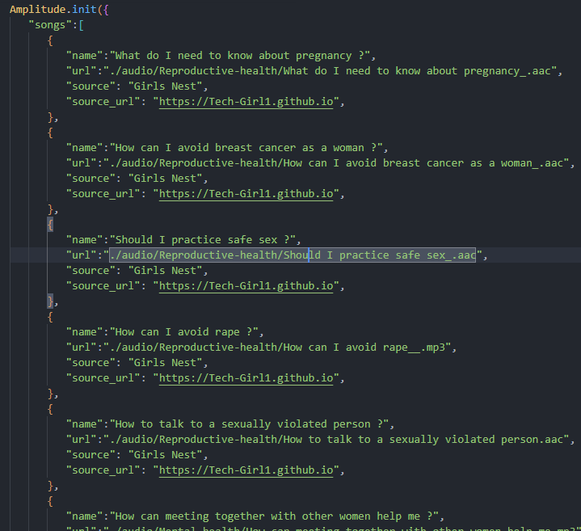

# Girls Nest

Women have always been at the center of the society, and while they are seen as one of the people at the forefront, they have been affected by various problems. 

During the covid 19 pandemic, there was a trend, "Justice for Uwa" on the social media. A teenager who was raped. She couldn't contain the feeling that she died at the end of the day. A lot of women go through cases even more weightier than this. They end up having no one to talk to or run to and this have lead to depression, mental stress and so many more. 

There are organization focused on solving problems for the girl child but it's not enough and that's where Girlverse Foundation comes in. 

Girlverse is an organization focused on helping females who have been affected sexually and mentally. We help them speak out, know how to handle these problems and also get all the support they need. 

## Case study
Meet Adesua, a 22 years old lady who went to a chapel at night to pray but ended up being raped by two men. She couldn't survive it because her voice was absorbed by the rain and no one could save her. A girl with so much dreams lost her life just like that and left her family shattered. 

Solution: Girls Nest is a platform built as a safe space for marginalized girls and women who have been affected sexually, mentally with access to incorporated audios and articles based on educative tips. Also, where they can reach out to us and we connect them with agencies which can be of great help to them. Companies and individuals can donate to this cause thereby helping women who has been affected.

## Features of the application
* Companies or individuals can donate to a particular cause or help women who have been affected. 
* We also incorporated an audio based educative tips to help people who are going through problems
* They can reach out to us with their problems and we connect them to agencies which can help them. 

## Extra Features not currently in the web app

* Incorporation of native languages for ladies from different places around the world where English is not understood. 
* A safe space where these ladies that can relate to what the other is passing through can meet up with themselves and get to air their views
* A place where these ladies can have access to learn non technical and technical skills. 
* An open space where ladies that do not mind can share their stories. To help keep others motivated. One can also decide to be anonymous. 

## Building the WebApp

### Setting up SEO

Go to `index.html` in the root directory of the project, in the 
    `<head>` tag, add your meta tags for SEO.

### Adding Audios

Go to `girls-nest/audio` and add your audio files. Then go to `girls-nest/audio.js` and add the audio file name to the `songs` array.

### Customizing the WebApp

Go to `site.webmanifest` in the root directory of the project, in the `short_name`, `name`, `description` fields, add your custom name and description for the WebApp.
site.webmanifest file is used to customize the WebApp.

### Setting WebApps service worker

Go to `sw.js` in the root directory of the project, in the `cacheName` field, add your custom name for the cache.
Service worker is used to cache the WebApp for offline use.

