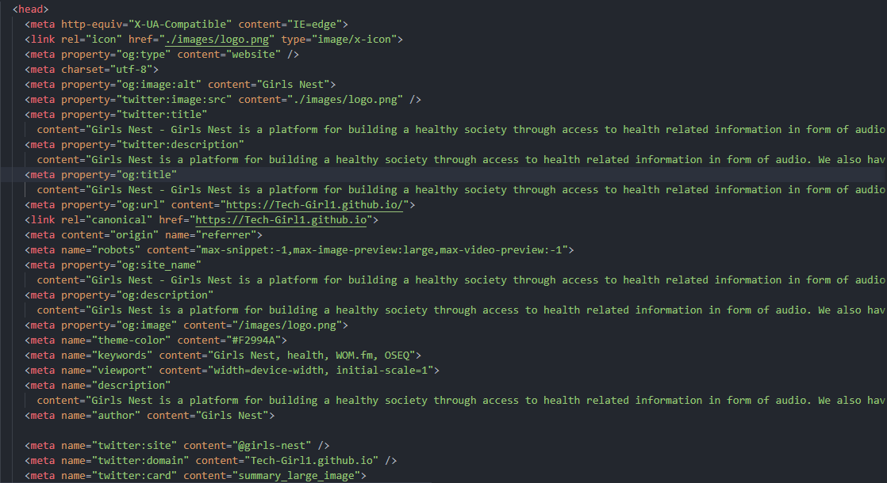

# Girls Nest

## Building the WebApp

### Setting up SEO

Go to `index.html` in the root directory of the project, in the 
    `<head>` tag, add your meta tags for SEO.

### Adding Audios

Go to `girls-nest/audio` and add your audio files. Then go to `girls-nest/audio.js` and add the audio file name to the `songs` array.

### Customizing the WebApp

Go to `site.webmanifest` in the root directory of the project, in the `short_name`, `name`, `description` fields, add your custom name and description for the WebApp.
site.webmanifest file is used to customize the WebApp.

### Setting WebApps service worker

Go to `sw.js` in the root directory of the project, in the `cacheName` field, add your custom name for the cache.
Service worker is used to cache the WebApp for offline use.

