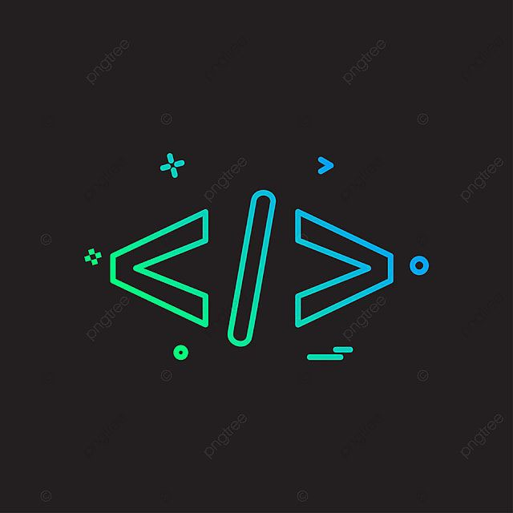

# Girls Nest

Women have always been at the center of the society,they are the unsung heroes in every family. While they are seen as one of the people at the forefront, 
they have been affected by various problems ranging from sexual harassment to more advanced form of domestic violence or gender based violence. Most of them have lost the hold of their voices. No one to talk to, cry to, not even empathise with them. Of most concern is the fact that most women in underdeveloped societies are illetrates. They serve as a trade off. This have led to lack of women who can participate fully in the society and a shrinkage in skills. The workforce isn't balanced.
women are unable to take advantage of the mobile internet.

During the covid 19 pandemic, there was a trend, "Justice for Uwa" on the social media. A teenager who was raped. 
She couldn't contain the feeling that she was raped by three men and died at the end of the day. A lot of women go through cases even more 
problems weightier than this and this have lead to depression, mental 
stress and so many more. 

There are organization focused on solving problems for the girl child but it's not enough and that's where 
Girls Nest Foundation comes in.

Girls Nest is an organization focused on helping females who have been affected sexually and mentally. We help 
them speak out, know how to handle these problems and also get all the support they need. 

## Case study
Meet Adesua, a 22 years old lady who went to a chapel at night to pray but ended up being raped by two men. 
She couldn't survive it because her voice was absorbed by the rain and no one could save her. A girl with so 
much dreams lost her life just like that and left her family shattered. 

Solution: Girls Nest is a platform built as a safe space for marginalized girls and women who have been 
affected sexually, mentally with access to incorporated audios and articles based on educative tips. Also, 
where they can reach out to us and we connect them with agencies which can be of great help to them. 
Companies and individuals can donate to this cause thereby helping women who has been affected.

## Features of the application
* A safe space where people who have been affected can reach out to us and get a chance to connect with our professionals. 
* We are going to connect them to agencies or companies where they can learn relevant tech or non- tech skills. 
* Companies or individuals can donate to a particular cause or help women who have been affected there by empowering them financially. 
* We also incorporated an audio based educative tips to help people who are going through problems
* They can reach out to us with their problems and we connect them to agencies which can help them. 
* Incorporation of native languages for ladies from different places around the world where English 
is not understood. 

For more information scan the QR code to visit Girls Nest

## Building the WebApp

In this guide, we will be discussing about our solution and how we built
our web app using technologies like Vs code, HTML, CSS, Bootstrap, JavaScript and Github.

## Defining the workflow

### Project objective

Our project is a a web application built a safe space for
marginalized girls and women who have been affected sexually, 
mentally, giving them access to educational audios, a platform
for seeking support from a professionals, and a space for individuals
or agencies to contribute to this cause.

### Web application structure

This web application consists of:

* A landing page - This is where the product branding is implemented.  
The header contains the objective of the project. The body contains 
the features and content of the webapp, and a "Get started" button. And 
lastly, at the bottom of the page, the footer comprises contact link and 
our partners information.

* An Explore page – This an exploring page where users can 
     – Access the audios
     – Chat a professional
     – And donate to our cause

* Audio page - We used the wom.fm template existing structure to develop 
the audio in the web application.

* Chat a professional page - This is a page built with php, containing a 
form that sends us an email when filled.
We created a [Tawk.to](http://tawk.to) account and linked to the page, 
thereby when clicked, sends us a message.

* Donate to the cause - This is a page built solely for Companies and 
individuals who visit the page and want to donate to our cause thereby helping 
women who have been affected.

## Designing the Interface/prototype
Design presentation link of Girls Nest on Behance
(https://www.behance.net/gallery/155953431/Girls-Nest-audio-application/modules/879912351)

## Technologies used 

### [Visual studio code](https://code.visualstudio.com/download)
This is a software application used for editing, testing and packaging and
developing codes efficiently.

### [HTML](https://html.com/) - 
HTML is a language for describing the structure 
of Web pages. HTML gives authors the means to: Publish online documents with headings, 
text, tables, lists, images, etcetera.

### [CSS](https://developer.mozilla.org/en-US/docs/Web/CSS)
This is for describing the 
presentation of Web pages, including colors, layout, and fonts.

### [Bootstrap](https://getbootstrap.com/) 
Bootstrap is a free CSS open source front-end 
development framework for the creation of websites and web apps designed to enable 
responsive development.

### [JavaScript](https://www.javascript.com/) 
Javascript is used to create dynamic
and interactive web content like applications and browsers. We added our audios 
using Javascript.

### [Github](https://docs.github.com/en/get-started/quickstart/hello-world)
This is a code hosting platform for version control and collaboration. It lets 
you and others work together on projects from anywhere.

These technologies were put together to build our webapp.

## Getting started

### Setting up SEO

Go to `index.html` in the root directory of the project, in the 
    `<head>` tag, add your meta tags for SEO.

### Adding Audios

Go to `girls-nest/audio` and add your audio files. Then go to `girls-nest/audio.js` and 
add the audio file name to the `songs` array.

### Customizing the WebApp

Go to `site.webmanifest` in the root directory of the project, in the `short_name`, `name`, `description` fields, 
add your custom name and description for the WebApp.
site.webmanifest file is used to customize the WebApp.

### Setting WebApps service worker

Go to `sw.js` in the root directory of the project, in the `cacheName` field, add your custom name for the cache.
Service worker is used to cache the WebApp for offline use.

